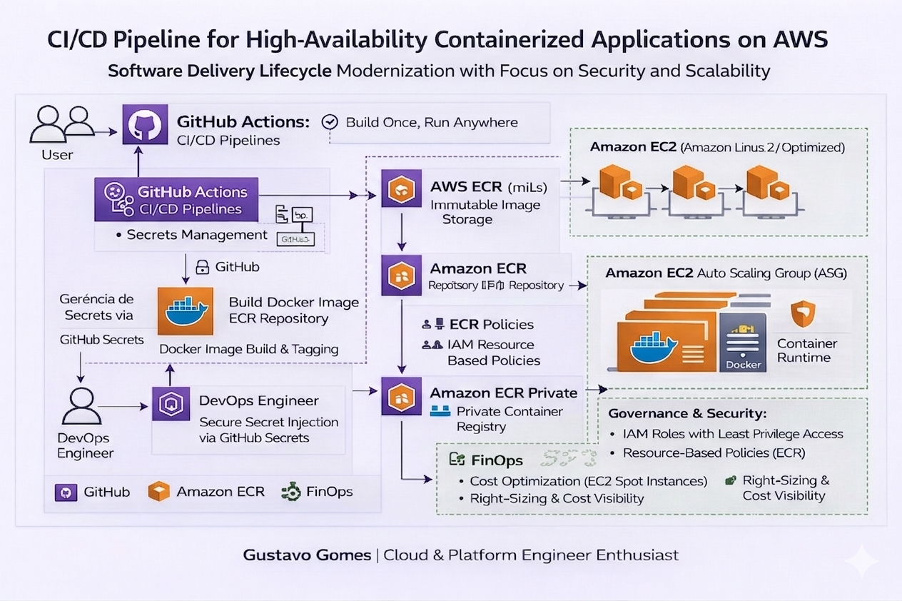

# ⚓ CI/CD Pipeline: High-Availability Docker Deployment na AWS
### *Modernização de Ciclo de Vida de Software com Foco em Segurança e Escalabilidade*

## 📝 Visão Executiva
Este projeto estabelece uma esteira de **CI/CD (Continuous Integration & Continuous Deployment)** de nível corporativo para aplicações Node.js. A solução foi projetada para eliminar gargalos manuais, mitigar riscos de segurança e garantir que o software seja entregue com **imutabilidade** através de containers Docker. 

O objetivo central foi implementar uma cultura de **"Build Once, Run Anywhere"**, garantindo que a aplicação se comporte de forma idêntica desde o ambiente de desenvolvimento até a produção na AWS.

---

## 🏗️ Arquitetura e Engenharia de Stack
A infraestrutura foi projetada seguindo os princípios do AWS Well-Architected Framework, com foco em escalabilidade, segurança, confiabilidade e eficiência operacional.

🔹 Runtime & Application
Aplicação desenvolvida em Node.js, otimizada para operações assíncronas e alta performance em cenários distribuídos.

🔹 Containerization Strategy
Utilização de Docker para empacotamento da aplicação e suas dependências, garantindo portabilidade, isolamento e consistência entre ambientes (Build Once, Run Anywhere).

🔹 CI/CD Orchestration

Orquestração do pipeline através do GitHub Actions, responsável por:

* Build automatizado da aplicação
* Criação e versionamento de imagens Docker (tagging)
* Push das imagens para o repositório
* Injeção segura de variáveis via GitHub Secrets

🔹 Container Registry

Uso do Amazon Elastic Container Registry (ECR) como repositório privado para armazenamento de imagens Docker, com:

* Imutabilidade de imagens
* Baixa latência para consumo dentro da AWS
* Controle de acesso via IAM e Resource-Based Policies

🔹 Compute Layer

Execução dos containers em Amazon EC2 Auto Scaling Group (ASG) utilizando Amazon Linux 2 (Optimized AMI), garantindo:

* Alta disponibilidade
* Escalabilidade automática baseada em demanda
* Execução isolada via Docker Engine (Container Runtime)

🔹 Identity & Access Management (IAM)

Implementação de IAM Roles com políticas granulares seguindo o princípio de:

* Least Privilege (Princípio do Menor Privilégio)
* Controle seguro de acesso entre serviços (EC2 ↔ ECR)
* Suporte a cenários de Cross-Account Access, quando necessário

🔹 Governance & Security

Camada de governança aplicada com:

* IAM Roles seguras por workload
* Policies baseadas em recursos (ECR)
* Controle de acesso centralizado
* Isolamento de responsabilidades (DevOps / Infra / Runtime)

🔹 FinOps (Cloud Financial Management)

Adoção de práticas de FinOps para otimização de custos, incluindo:

* Uso de EC2 Spot Instances quando aplicável
* Estratégias de right-sizing
* Monitoramento de consumo e eficiência de recursos

---

## 🧠 Deep Dive: Desafios Técnicos e Troubleshooting (Diferencial)

Enfrentei e resolvi desafios reais de infraestrutura, demonstrando capacidade analítica em cenários de crise:

### 1. Governança de Acesso Cross-Resource (IAM Deep Dive)
* **Desafio:** Falhas de `Access Denied` durante o `docker pull` na instância EC2, apesar das credenciais básicas.
* **Resolução:** Diagnostiquei que a política do repositório ECR não permitia explicitamente a entidade principal da EC2. Implementei uma **Resource-based Policy** no ECR, aplicando o **Princípio do Menor Privilégio (PoLP)**.

### 2. Ciclo de Feedback e Depuração de Runtime
* **Desafio:** O container iniciava com erro devido a falhas de sintaxe pós-injeção de dependências no pipeline.
* **Resolução:** Utilizei inspeção profunda via `docker logs -f` e `docker inspect`. Validei a correção via CLI em ambiente isolado antes de persistir no Git, reduzindo drasticamente o **MTTR (Mean Time To Repair)**.

### 3. Networking e Exposição Estratégica
* **Desafio:** Necessidade de expor a aplicação na porta padrão 80 enquanto o runtime operava em 8080.
* **Resolução:** Implementei o mapeamento de portas nativo do Docker (`80:8080`), isolando a camada de rede do container e reforçando a segurança perimetral da instância.

---

✅ Validação de Sucesso (Diferencial)
Abaixo, as evidências de que a aplicação está acessível e funcional no ambiente de nuvem da AWS, validando todo o ciclo de engenharia:

Primeiro acesso: Validação da aplicação respondendo via IP público da AWS após a configuração do EC2.

Deploy Final: Confirmação da aplicação Dockerizada rodando em uma instância EC2, pronta para produção.

---

## ⚙️ Governança e Segurança (GitHub Secrets)
O pipeline consome segredos criptografados, garantindo conformidade com padrões de segurança:

| Secret | Finalidade Técnica |
| :--- | :--- |
| `AWS_ACCESS_KEY_ID` | Autenticação programática no provedor de nuvem. |
| `AWS_SECRET_ACCESS_KEY` | Chave privada para assinatura de requisições API. |
| `AWS_REGION` | Definição da localidade geográfica (ex: us-east-1). |
| `ECR_REPOSITORY` | Namespace exclusivo para o artefato da aplicação. |

---

## 📈 Resultados e Valor de Negócio
* **Agilidade:** Redução de **95% no tempo de deploy** (de 20 minutos manuais para < 60 segundos).
* **Segurança:** Zero exposição de chaves AWS em arquivos de configuração ou máquinas locais.
* **Confiabilidade:** Ambientes imutáveis que eliminam o erro "na minha máquina funciona".

---
**Autor:** Gustavo Gomes | *Cloud & DevOps Engineer Enthusiast*
